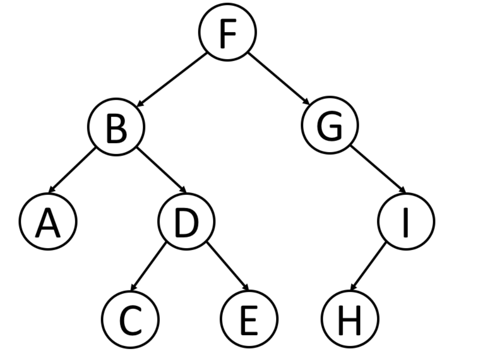

## 树

### 概述

是一种的数据结构，用来模拟具有树状结构性质的数据集合
二叉树就是典型的树状结构，二叉树是每个节点最多有**两个子树**的树结构，通常子树被称作“左子树”和“右子树”。

### 树的遍历

- 前序遍历

  前序遍历首先访问根节点，然后遍历左子树，最后遍历右子树

- 中序遍历

  前序遍历首先访问左子树，然后遍历根节点，最后遍历右子树

- 后序遍历

  前序遍历首先访问左子树，然后遍历右子树，最后遍历根节点

- 层次遍历

  广度优先遍历方法先访问根节点，然后遍历邻节点，其次遍历它的二级、三级邻节点，以此类推

- 递归遍历

  - 自上而下的深度优先遍历：在每一个递归的栈中都要访问节点计算值，在下一次递归中将值传递下一次
  - 自下而上的深度优先遍历：在每一个递归的栈中，首先对所有子节点递归调用函数，然后根据返回值和根节点本身值在计算

### 题目

- 计算二叉树的深度

  - 广度遍历

    > 存放层次的栈，先存第一层根节点

    > 依次拿出栈的节点（在那节点同时看有没有下一层的 left， right），直到栈空了

    > 在每一层遍历都要记录层级

  - 自上而下深度遍历

    > 要计算层级，将层级传递下去在计算
