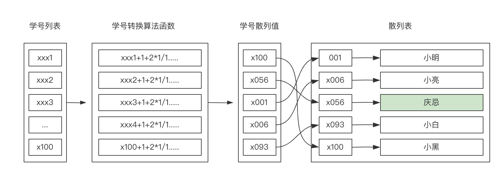
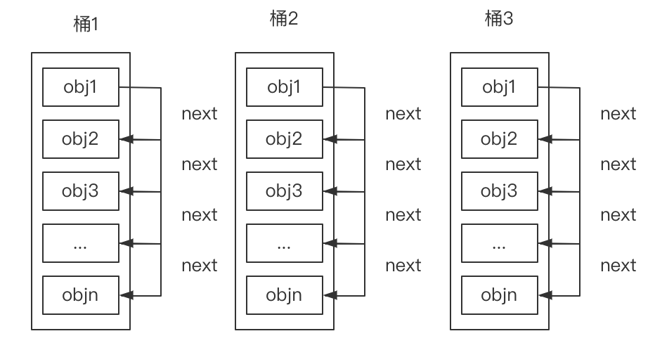

### 散列表（hash） 概述

- hash 一般翻译为散列
- 是把任意长度的输入变成一个固定长度的输出（输出就是散列值）是经过压缩处理后的
- 输入的空间要比输出的空间占比小

#### 举例

- O(n)复杂度的查找
  一个班级有小明、小亮、庆忌等 100 个学生， 如何需要查找庆忌同学，需要从 1 个学生开始到 100 个学生去遍历，直到找到了庆忌同学

- O(1)复杂度的查找
  一个班级有小明、小亮、庆忌等 100 个学生，通过 100 个学号存在数组[1,2,3,.....100],庆忌同学的学号就可以['xx']直接找到

  

  > 通过散列函数来转换学号，获取散列值
  > 获取散列值后就可以直接获取庆忌同学

### 链表

> 链表这里就不做多介绍了可以参考后续算法结构里面会介绍

### 桶思想

> 可以参考后续算法结构里面会介绍

> 每一个桶里面有 n 个位置，每一个位置都是一个对象，通过 next 属性指向下一个对象

> 每一个桶之间串联

### Map 思想

- 借助 hash 算法 来实现输入**不确定**的值通过散列函数转换后变成一个**确定**的 key
- 借助链表对元素在中间过程中添加、删除是比较快的，只要改变指针方向就行
- 借助桶思想为了保证数据存储过大时候，导致查询效率低,（简单理解就是分组）

### Map 实现原理

[实现](./base.js)
